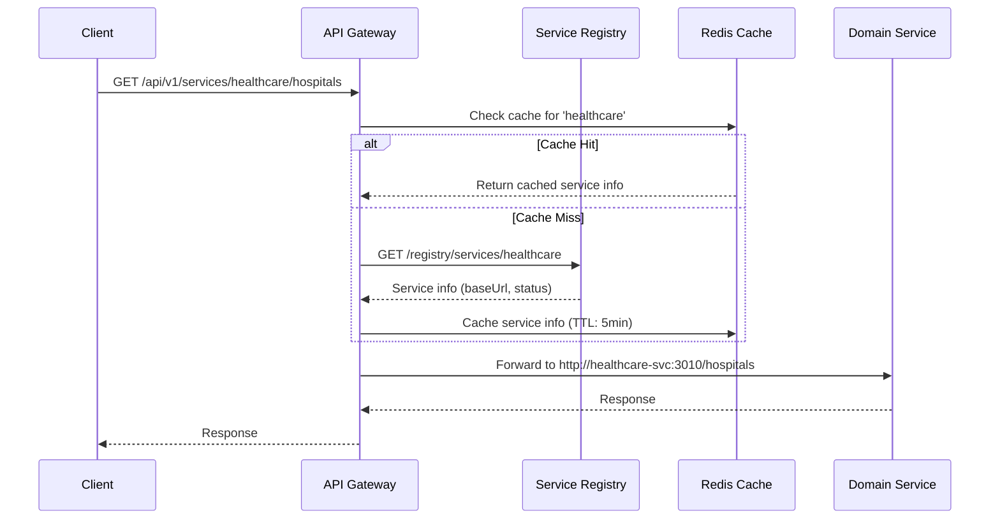
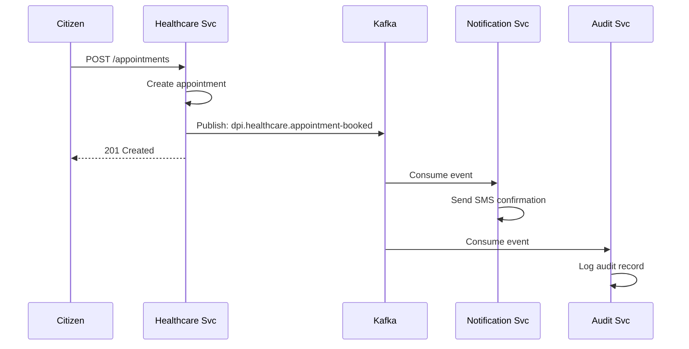

# National-Scale Digital Public Infrastructure (DPI) Platform

> **Ingenious Hackathon 7.0** — Building Trustworthy, Scalable, and Human-Centered Digital Systems for the Next Decade

[](LICENSE)
[](#)
[](https://nodejs.org)
[](https://nestjs.com)

---

## Table of Contents

1. [Executive Summary](#1-executive-summary)
2. [Hackathon Theme Alignment](#2-hackathon-theme-alignment)
3. [Platform Architecture Overview](#3-platform-architecture-overview)
4. [Core Platform Components](#4-core-platform-components)
5. [Dynamic API Gateway Design](#5-dynamic-api-gateway-design)
6. [Service Registry & Discovery](#6-service-registry--discovery)
7. [Service Onboarding Flow](#7-service-onboarding-flow)
8. [Mock Domain Services](#8-mock-domain-services)
9. [Data Exchange & Event Architecture](#9-data-exchange--event-architecture)
10. [Scalability & Reliability](#10-scalability--reliability)
11. [Security Architecture](#11-security-architecture)
12. [Observability Stack](#12-observability-stack)
13. [Project Structure](#13-project-structure)
14. [Quick Start](#14-quick-start)
15. [Future Evolution](#15-future-evolution)

---

## 1. Executive Summary

### The Problem

India's digital public services are fragmented across multiple independent systems—each with its own authentication, API standards, and data formats. Adding a new government service requires:
- Building authentication from scratch
- Creating a new frontend portal
- Establishing separate infrastructure
- No interoperability with existing services

### Our Solution

We present a **Shared Digital Platform** that provides:

| Capability | Description |
|------------|-------------|
| **Unified Identity** | Single authentication via DigiLocker + Aadhaar eKYC |
| **Dynamic Service Registry** | Register new services at runtime without code changes |
| **Self-Routing Gateway** | API Gateway resolves routes dynamically from registry |
| **Event-Driven Integration** | Services communicate via Kafka events |
| **Multi-Tenant Frontend** | Single portal serving citizens, admins, and service providers |

### What We're NOT Building

> ❌ Three independent applications for healthcare, agriculture, and urban services  
> ✅ **One platform** that can host ANY number of services dynamically

---

## 2. Hackathon Theme Alignment

### Theme: "Building Trustworthy, Scalable, and Human-Centered Digital Systems for the Next Decade"

| Theme Pillar | How Our Platform Addresses It |
|--------------|-------------------------------|
| **Trustworthy** | DigiLocker + Aadhaar provides verifiable identity. All actions are audit-logged. No data silos. |
| **Scalable** | Stateless microservices, horizontal scaling, Kafka for async processing. Designed for 100M+ users. |
| **Human-Centered** | Single citizen portal for all services. Vernacular support ready. Accessibility-first design. |
| **Next Decade** | Platform-level extensibility means NEW services can be added in 2035 without modifying core. |

### Problem Statement Alignment (PS-1)

| Requirement | Our Implementation |
|-------------|-------------------|
| Core platform with service registry | ✅ Service Registry is the central nervous system |
| 2–3 mock services | ✅ Healthcare, Agriculture, Urban Grievance |
| Dynamic service onboarding | ✅ Register → Deploy → Automatically Routed |
| Frontend for citizens, admins, providers | ✅ Role-based UI from single React app |
| Scalability demonstration | ✅ Kubernetes-ready, load tested architecture |

---

## 3. Platform Architecture Overview

### High-Level Architecture

```
┌─────────────────────────────────────────────────────────────────────────────────┐
│                                  CLIENT LAYER                                    │
│                                                                                  │
│    ┌──────────────┐     ┌──────────────┐     ┌──────────────┐                   │
│    │   Citizen    │     │    Admin     │     │   Provider   │                   │
│    │    Portal    │     │  Dashboard   │     │   Console    │                   │
│    │   (React)    │     │   (React)    │     │   (React)    │                   │
│    └──────┬───────┘     └──────┬───────┘     └──────┬───────┘                   │
│           │                    │                    │                            │
│           └────────────────────┴────────────────────┘                            │
│                                │                                                  │
└────────────────────────────────┼─────────────────────────────────────────────────┘
                                 │
                                 ▼
┌────────────────────────────────────────────────────────────────────────────────┐
│                              API GATEWAY                                         │
│                                                                                  │
│  ┌─────────────────────────────────────────────────────────────────────────┐   │
│  │                    DYNAMIC ROUTE RESOLVER                                │   │
│  │                                                                          │   │
│  │   /api/v1/services/{service-name}/*  ──► Resolve from Service Registry  │   │
│  │                                                                          │   │
│  │   Example:                                                               │   │
│  │   /api/v1/services/healthcare/hospitals  ──► http://healthcare-svc/...  │   │
│  │   /api/v1/services/agriculture/schemes   ──► http://agriculture-svc/... │   │
│  │   /api/v1/services/urban/grievances      ──► http://urban-svc/...       │   │
│  │   /api/v1/services/[ANY-NEW-SVC]/*       ──► Auto-resolved at runtime   │   │
│  │                                                                          │   │
│  └─────────────────────────────────────────────────────────────────────────┘   │
│                                                                                  │
│  ┌─────────────┐  ┌─────────────┐  ┌─────────────┐  ┌─────────────┐            │
│  │ Rate Limit  │  │  JWT Auth   │  │   Logging   │  │   Caching   │            │
│  └─────────────┘  └─────────────┘  └─────────────┘  └─────────────┘            │
│                                                                                  │
└────────────────────────────────────────────────────────────────────────────────┘
                                 │
                                 ▼
┌────────────────────────────────────────────────────────────────────────────────┐
│                           PLATFORM CORE SERVICES                                 │
│                                                                                  │
│  ┌────────────────────┐           ┌────────────────────┐                        │
│  │   SERVICE REGISTRY │◄──────────│    IDENTITY SVC    │                        │
│  │                    │           │                    │                        │
│  │  • Service catalog │           │  • DigiLocker OAuth│                        │
│  │  • Health status   │           │  • Twilio OTP      │                        │
│  │  • Endpoint URLs   │           │  • JWT tokens      │                        │
│  │  • Metadata        │           │  • RBAC            │                        │
│  │  Port: 3002        │           │  Port: 3001        │                        │
│  └────────────────────┘           └────────────────────┘                        │
│                                                                                  │
│  ┌────────────────────┐           ┌────────────────────┐                        │
│  │  NOTIFICATION SVC  │           │     AUDIT SVC      │                        │
│  │                    │           │                    │                        │
│  │  • SMS (Twilio)    │           │  • Event logging   │                        │
│  │  • Email           │           │  • Compliance      │                        │
│  │  • Push            │           │  • Analytics       │                        │
│  │  Port: 3003        │           │  Port: 3004        │                        │
│  └────────────────────┘           └────────────────────┘                        │
│                                                                                  │
└────────────────────────────────────────────────────────────────────────────────┘
                                 │
                                 ▼
┌────────────────────────────────────────────────────────────────────────────────┐
│                          DOMAIN SERVICES (Dynamic)                               │
│                                                                                  │
│  ┌──────────────────┐  ┌──────────────────┐  ┌──────────────────┐              │
│  │   HEALTHCARE     │  │   AGRICULTURE    │  │      URBAN       │              │
│  │     SERVICE      │  │     SERVICE      │  │     SERVICE      │              │
│  │                  │  │                  │  │                  │              │
│  │  Hospitals       │  │  Crop Advisories │  │  Grievances      │              │
│  │  Doctors         │  │  Schemes         │  │  Complaints      │              │
│  │  Appointments    │  │  Market Prices   │  │  Status Tracking │              │
│  │                  │  │                  │  │                  │              │
│  │  Port: 3010      │  │  Port: 3011      │  │  Port: 3012      │              │
│  └──────────────────┘  └──────────────────┘  └──────────────────┘              │
│                                                                                  │
│       ┌──────────────────────────────────────────────────────────┐              │
│       │                    [FUTURE SERVICES]                      │              │
│       │   Education │ Transport │ Land Records │ Social Welfare   │              │
│       │          (Register at runtime, no gateway changes)        │              │
│       └──────────────────────────────────────────────────────────┘              │
│                                                                                  │
└────────────────────────────────────────────────────────────────────────────────┘
                                 │
                                 ▼
┌────────────────────────────────────────────────────────────────────────────────┐
│                              DATA LAYER                                          │
│                                                                                  │
│  ┌────────────────┐  ┌────────────────┐  ┌────────────────┐                     │
│  │   PostgreSQL   │  │     Redis      │  │     Kafka      │                     │
│  │   (TypeORM)    │  │    (Cache)     │  │   (Events)     │                     │
│  │   Port: 5432   │  │   Port: 6379   │  │   Port: 9092   │                     │
│  └────────────────┘  └────────────────┘  └────────────────┘                     │
│                                                                                  │
└────────────────────────────────────────────────────────────────────────────────┘
```

### Key Architectural Principle

> **The API Gateway does NOT know about specific services.**  
> It only knows how to:
> 1. Parse the service name from the URL (`/api/v1/services/{service-name}/*`)
> 2. Query the Service Registry for that service's endpoint
> 3. Forward the request to the resolved endpoint

This is what makes the platform **truly extensible**.

---

## 4. Core Platform Components

The platform core is **service-agnostic**. It provides shared capabilities that ANY domain service can use.

### 4.1 Component Overview

| Component | Responsibility | Port |
|-----------|---------------|------|
| **API Gateway** | Dynamic routing, auth, rate limiting | 3000 |
| **Service Registry** | Service catalog, health, discovery | 3002 |
| **Identity Service** | Authentication (Google OAuth, Mobile OTP, JWT) | 3001 |
| **Notification Service** | SMS, Email, Push notifications | 3003 |
| **Audit Service** | Event logging, compliance | 3004 |

### 4.2 What Platform Core Does NOT Do

- ❌ Define business logic for any domain
- ❌ Store domain-specific data
- ❌ Have hardcoded knowledge of healthcare, agriculture, etc.
- ❌ Require modification when new services are added

---

## 5. Dynamic API Gateway Design

### 5.1 The Problem with Static Routes

**❌ WRONG (Static Routing):**
```typescript
// This breaks extensibility - requires code changes for every new service
@Controller('healthcare')    // Hardcoded
@Controller('agriculture')   // Hardcoded
@Controller('urban')         // Hardcoded
```

Every new service requires:
1. New proxy controller
2. Gateway redeployment
3. Testing regression

### 5.2 The Correct Approach: Dynamic Resolution

**✅ CORRECT (Dynamic Routing):**

```
URL Pattern: /api/v1/services/{service-name}/**

Example Requests:
  /api/v1/services/healthcare/hospitals
  /api/v1/services/agriculture/schemes
  /api/v1/services/urban/grievances
  /api/v1/services/education/courses     ← Future service
  /api/v1/services/transport/tickets     ← Future service
```

### 5.3 Gateway Routing Logic

```typescript
@Controller('services')
export class DynamicProxyController {
  constructor(
    private serviceRegistry: ServiceRegistryClient,
    private httpService: HttpService,
  ) {}

  @All(':serviceName/*')
  async proxy(
    @Param('serviceName') serviceName: string,
    @Req() req: Request,
  ) {
    // 1. Lookup service in registry (with caching)
    const service = await this.serviceRegistry.getService(serviceName);
    
    if (!service || service.status !== 'ACTIVE') {
      throw new NotFoundException(`Service '${serviceName}' not found`);
    }

    // 2. Construct target URL
    const targetPath = req.url.replace(`/api/v1/services/${serviceName}`, '');
    const targetUrl = `${service.baseUrl}${targetPath}`;

    // 3. Forward request
    return this.forwardRequest(targetUrl, req);
  }
}
```

### 5.4 Gateway Responsibilities

| Responsibility | Implementation |
|----------------|----------------|
| **Dynamic Routing** | Resolve service endpoints from registry at runtime |
| **Authentication** | Validate JWT tokens for protected routes |
| **Rate Limiting** | 100 requests/minute per user |
| **Request Logging** | Correlation IDs, request/response logging |
| **Response Caching** | Cache idempotent GET responses in Redis |

### 5.5 What Gateway Does NOT Do

- ❌ Define per-service routes
- ❌ Know about healthcare, agriculture, urban
- ❌ Contain domain-specific logic
- ❌ Require changes when new services are added

---

## 6. Service Registry & Discovery

### 6.1 Purpose

The Service Registry is the **central catalog** of all services in the platform. It enables:
- Dynamic service discovery
- Health monitoring
- Automatic failover
- Service metadata management

### 6.2 Service Registration Model

```typescript
interface RegisteredService {
  // Identity
  id: string;                    // UUID
  name: string;                  // Unique identifier: "healthcare", "agriculture"
  displayName: string;           // "Healthcare Services"
  description: string;           // Human-readable description
  
  // Connectivity
  baseUrl: string;               // "http://healthcare-svc:3010"
  healthEndpoint: string;        // "/health"
  
  // Status
  status: 'ACTIVE' | 'INACTIVE' | 'MAINTENANCE';
  lastHealthCheck: Date;
  healthStatus: 'HEALTHY' | 'UNHEALTHY' | 'DEGRADED';
  
  // Metadata
  version: string;               // "1.0.0"
  owner: string;                 // "health-ministry"
  tags: string[];                // ["healthcare", "appointments"]
  
  // Documentation
  apiDocsUrl?: string;           // Swagger/OpenAPI URL
  
  // Access Control
  isPublic: boolean;             // Can unauthenticated users access?
  requiredRoles?: string[];      // Minimum roles required
  
  // Timestamps
  registeredAt: Date;
  updatedAt: Date;
}
```

### 6.3 Service Registry API

| Method | Endpoint | Description |
|--------|----------|-------------|
| POST | `/registry/services` | Register a new service |
| GET | `/registry/services` | List all registered services |
| GET | `/registry/services/:name` | Get service by name |
| PUT | `/registry/services/:name` | Update service |
| DELETE | `/registry/services/:name` | Deregister service |
| PUT | `/registry/services/:name/status` | Update status |
| GET | `/registry/health` | Aggregated platform health |

### 6.4 Service Discovery Flow



### 6.5 Health Check Mechanism

The registry periodically checks registered services:

```typescript
@Cron('*/30 * * * * *') // Every 30 seconds
async checkServiceHealth() {
  const services = await this.getActiveServices();
  
  for (const service of services) {
    try {
      const response = await this.http.get(
        `${service.baseUrl}${service.healthEndpoint}`,
        { timeout: 5000 }
      );
      
      await this.updateHealthStatus(
        service.id,
        response.data.status === 'healthy' ? 'HEALTHY' : 'DEGRADED'
      );
    } catch (error) {
      await this.updateHealthStatus(service.id, 'UNHEALTHY');
      
      // Emit event for alerting
      this.eventEmitter.emit('service.unhealthy', service);
    }
  }
}
```

---

## 7. Service Onboarding Flow

### 7.1 Overview

This is the critical differentiator of our platform. Adding a new service requires:

| Step | Action | Code Changes to Platform Core |
|------|--------|------------------------------|
| 1 | Develop new microservice | ❌ None |
| 2 | Deploy service (Docker/K8s) | ❌ None |
| 3 | Register in Service Registry | ❌ None |
| 4 | Service is now accessible via Gateway | ❌ None |

### 7.2 Step-by-Step Onboarding: Adding "Education Service"

#### Step 1: Develop the Service

Create a standard NestJS microservice following platform conventions:

```bash
# In the india-dpi monorepo
nx generate @nx/nest:application education-svc
```

```typescript
// apps/education-svc/src/main.ts
@Controller('education')
export class EducationController {
  @Get('courses')
  getCourses() { return [...courses]; }
  
  @Get('health')
  health() { return { status: 'healthy' }; }
}
```

#### Step 2: Deploy the Service

```yaml
# docker-compose.override.yml (or Kubernetes manifest)
education-svc:
  build: ./apps/education-svc
  ports:
    - "3013:3013"
  environment:
    - PORT=3013
```

#### Step 3: Register in Service Registry

```bash
curl -X POST http://localhost:3002/registry/services \
  -H "Content-Type: application/json" \
  -H "Authorization: Bearer $ADMIN_TOKEN" \
  -d '{
    "name": "education",
    "displayName": "Education Services",
    "description": "Course catalog, enrollment, certificates",
    "baseUrl": "http://education-svc:3013",
    "healthEndpoint": "/education/health",
    "version": "1.0.0",
    "owner": "education-ministry",
    "tags": ["education", "courses", "certificates"],
    "isPublic": false,
    "requiredRoles": ["citizen"]
  }'
```

#### Step 4: Access via Gateway

```bash
# Immediately accessible - no gateway changes needed!
curl http://localhost:3000/api/v1/services/education/courses
```

### 7.3 Onboarding Flow Diagram

```
┌─────────────────────────────────────────────────────────────────────────────┐
│                        SERVICE ONBOARDING FLOW                               │
└─────────────────────────────────────────────────────────────────────────────┘

    ┌──────────────┐
    │   DEVELOP    │
    │  New Service │
    └──────┬───────┘
           │
           ▼
    ┌──────────────┐
    │    DEPLOY    │
    │  (Docker/K8s)│
    └──────┬───────┘
           │
           ▼
    ┌──────────────┐     ┌─────────────────────────────────────────────┐
    │   REGISTER   │────▶│            SERVICE REGISTRY                 │
    │   (API call) │     │                                             │
    └──────┬───────┘     │  ┌─────────────────────────────────────┐   │
           │             │  │ Services:                            │   │
           │             │  │  - healthcare  → http://hc-svc:3010 │   │
           │             │  │  - agriculture → http://ag-svc:3011 │   │
           │             │  │  - urban       → http://ub-svc:3012 │   │
           │             │  │  - education   → http://ed-svc:3013 │ ← NEW
           │             │  └─────────────────────────────────────┘   │
           │             └─────────────────────────────────────────────┘
           │
           ▼
    ┌──────────────┐     ┌─────────────────────────────────────────────┐
    │ AUTOMATICALLY│     │              API GATEWAY                    │
    │   ROUTED     │────▶│                                             │
    └──────────────┘     │  /api/v1/services/education/*              │
                         │        │                                    │
                         │        ▼                                    │
                         │  Resolves to http://ed-svc:3013/*          │
                         └─────────────────────────────────────────────┘

                         ┌─────────────────────────────────────────────┐
                         │ ✅ NO CHANGES REQUIRED TO:                  │
                         │    • API Gateway code                       │
                         │    • Frontend application                   │
                         │    • Identity service                       │
                         │    • Any other platform component           │
                         └─────────────────────────────────────────────┘
```

### 7.4 Frontend Integration

The frontend dynamically fetches available services from the registry:

```typescript
// Frontend: Fetch available services
const services = await fetch('/api/v1/services');

// Render navigation dynamically
services.forEach(service => {
  if (user.roles.includes(service.requiredRole) || service.isPublic) {
    renderNavItem(service.displayName, `/services/${service.name}`);
  }
});
```

---

## 8. Mock Domain Services

We demonstrate platform capabilities with three mock services. These are **examples of what can run on the platform**, not the platform itself.

### 8.1 Healthcare Service (Port 3010)

**Purpose:** Hospital discovery, doctor booking, appointment management

| Entity | Description |
|--------|-------------|
| Hospital | Government hospitals with location, facilities |
| Doctor | Doctors with specialization, availability |
| Appointment | Booking with status workflow |

**Endpoints:**
```
GET  /{base}/hospitals              List hospitals
GET  /{base}/hospitals/:id          Hospital details
GET  /{base}/doctors/:id/slots      Available slots
POST /{base}/appointments           Book appointment
GET  /{base}/me/appointments        My appointments
```

### 8.2 Agriculture Service (Port 3011)

**Purpose:** Crop advisories, scheme applications, market prices

| Entity | Description |
|--------|-------------|
| CropAdvisory | Seasonal farming advice |
| Scheme | Government benefit schemes |
| MarketPrice | Commodity prices by mandi |

**Endpoints:**
```
GET  /{base}/advisories             List advisories
GET  /{base}/schemes                Available schemes
POST /{base}/schemes/:id/apply      Apply for scheme
GET  /{base}/market-prices          Current prices
```

### 8.3 Urban Service (Port 3012)

**Purpose:** Civic grievance submission and tracking

| Entity | Description |
|--------|-------------|
| Grievance | Citizen complaint with status |
| Category | Grievance categories (water, roads, etc.) |
| StatusUpdate | Timeline of grievance resolution |

**Endpoints:**
```
POST /{base}/grievances             Submit grievance
GET  /{base}/grievances/:id         Get status
GET  /{base}/me/grievances          My grievances
PUT  /{base}/grievances/:id/escalate Escalate
```

---

## 9. Data Exchange & Event Architecture

### 9.1 Synchronous Communication (REST)

- **External clients → Gateway**: REST over HTTPS
- **Gateway → Services**: REST over HTTP (internal network)
- **Service → Service**: REST for synchronous calls (via registry lookup)

### 9.2 Asynchronous Communication (Kafka)

For decoupled, reliable messaging:

```
Topic Naming Convention: dpi.{domain}.{event-type}

Examples:
  dpi.auth.user-registered
  dpi.auth.user-verified
  dpi.healthcare.appointment-booked
  dpi.healthcare.appointment-cancelled
  dpi.agriculture.scheme-applied
  dpi.urban.grievance-submitted
  dpi.urban.grievance-resolved
  dpi.notification.send-sms
  dpi.notification.send-email
  dpi.audit.event-logged
```

### 9.3 Event Schema (CloudEvents Specification)

```typescript
interface DPIEvent<T> {
  // CloudEvents required fields
  specversion: '1.0';
  id: string;              // UUID
  type: string;            // Event type: dpi.healthcare.appointment-booked
  source: string;          // Service: /services/healthcare
  time: string;            // ISO 8601
  
  // DPI extensions
  correlationId: string;   // Request tracing
  userId?: string;         // Acting user
  
  // Payload
  data: T;
}
```

### 9.4 Example: Cross-Service Event Flow



---

## 10. Scalability & Reliability

### 10.1 Horizontal Scaling

| Component | Scaling Strategy |
|-----------|-----------------|
| API Gateway | Multiple instances behind load balancer |
| Domain Services | Replicas per service based on load |
| PostgreSQL | Read replicas for query scaling |
| Redis | Redis Cluster for cache scaling |
| Kafka | Partition-based scaling |

### 10.2 Caching Strategy

| Data | Cache Location | TTL | Purpose |
|------|----------------|-----|---------|
| Service registry | Redis | 5 min | Avoid registry calls per request |
| User sessions | Redis | 24 hr | JWT validation cache |
| Static data (hospitals) | Redis | 1 hr | Reduce DB load |
| Rate limit counters | Redis | 1 min | Per-user throttling |

### 10.3 Circuit Breaker Pattern

```typescript
@Injectable()
export class CircuitBreaker {
  private failures = 0;
  private lastFailure: Date;
  private state: 'CLOSED' | 'OPEN' | 'HALF_OPEN' = 'CLOSED';

  async call<T>(fn: () => Promise<T>): Promise<T> {
    if (this.state === 'OPEN') {
      if (Date.now() - this.lastFailure.getTime() > 30000) {
        this.state = 'HALF_OPEN';
      } else {
        throw new Error('Circuit breaker is OPEN');
      }
    }

    try {
      const result = await fn();
      this.onSuccess();
      return result;
    } catch (error) {
      this.onFailure();
      throw error;
    }
  }
}
```

---

## 11. Security Architecture

### 11.1 Authentication Methods Overview

| Method | Use Case | Provider | Security Level |
|--------|----------|----------|----------------|
| **Google OAuth 2.0** | Primary authentication for citizens | Google | High (Verified email) |
| **Mobile OTP** | Fallback / Users without Google | Twilio Verify | High (Phone verified) |
| **Admin Login** | Platform administrators | Internal | High (Password + 2FA ready) |

---

### 11.2 Google OAuth 2.0 Flow (Primary)

#### Detailed ASCII Flow Diagram

```
┌─────────────────────────────────────────────────────────────────────────────────────────┐
│                           GOOGLE OAUTH 2.0 AUTHENTICATION FLOW                           │
└─────────────────────────────────────────────────────────────────────────────────────────┘

    ┌──────────┐          ┌──────────────┐          ┌──────────────┐          ┌──────────┐
    │  CITIZEN │          │  API GATEWAY │          │   AUTH SVC   │          │  GOOGLE  │
    │ (Browser)│          │  (Port 3000) │          │  (Port 3001) │          │  OAuth   │
    └────┬─────┘          └──────┬───────┘          └──────┬───────┘          └────┬─────┘
         │                       │                         │                       │
         │  1. Click "Login      │                         │                       │
         │     with Google"      │                         │                       │
         │──────────────────────>│                         │                       │
         │                       │                         │                       │
         │                       │  2. GET /auth/google    │                       │
         │                       │     /login              │                       │
         │                       │────────────────────────>│                       │
         │                       │                         │                       │
         │                       │                         │  3. Generate OAuth    │
         │                       │                         │     state (CSRF)      │
         │                       │                         │     Store in Redis    │
         │                       │                         │─────────┐             │
         │                       │                         │         │             │
         │                       │                         │<────────┘             │
         │                       │                         │                       │
         │                       │  4. 302 Redirect to     │                       │
         │                       │     Google OAuth URL    │                       │
         │<──────────────────────│<────────────────────────│                       │
         │                       │                         │                       │
         │  ┌─────────────────────────────────────────────────────────────────────>│
         │  │ 5. Redirect to:                                                      │
         │  │    https://accounts.google.com/o/oauth2/auth                         │
         │  │    ?client_id=GOOGLE_CLIENT_ID                                       │
         │  │    &redirect_uri=http://localhost:3000/api/v1/auth/google/callback   │
         │  │    &response_type=code                                               │
         │  │    &scope=openid%20email%20profile                                   │
         │  │    &state=<csrf_state>                                               │
         │  └──────────────────────────────────────────────────────────────────────│
         │                       │                         │                       │
         │                       │                         │  ┌────────────────────┤
         │                       │                         │  │ 6. User sees       │
         │                       │                         │  │    Google Login    │
         │                       │                         │  │    (Email/Pass)    │
         │                       │                         │  └────────────────────┤
         │                       │                         │                       │
         │                       │                         │  ┌────────────────────┤
         │                       │                         │  │ 7. User grants     │
         │                       │                         │  │    consent to      │
         │                       │                         │  │    DPI Platform    │
         │                       │                         │  └────────────────────┤
         │                       │                         │                       │
         │<────────────────────────────────────────────────────────────────────────│
         │  8. 302 Redirect to callback:                                           │
         │     /api/v1/auth/google/callback?code=AUTH_CODE&state=<csrf_state>      │
         │                       │                         │                       │
         │                       │                         │                       │
         │  9. Browser follows   │                         │                       │
         │     redirect          │                         │                       │
         │──────────────────────>│                         │                       │
         │                       │                         │                       │
         │                       │  10. Forward to Auth    │                       │
         │                       │      Service            │                       │
         │                       │────────────────────────>│                       │
         │                       │                         │                       │
         │                       │                         │  11. Validate CSRF    │
         │                       │                         │      state from Redis │
         │                       │                         │─────────┐             │
         │                       │                         │         │             │
         │                       │                         │<────────┘             │
         │                       │                         │                       │
         │                       │                         │  12. POST /token      │
         │                       │                         │      (exchange code)  │
         │                       │                         │─────────────────────>│
         │                       │                         │                       │
         │                       │                         │  13. Return:          │
         │                       │                         │      access_token     │
         │                       │                         │      id_token         │
         │                       │                         │<─────────────────────│
         │                       │                         │                       │
         │                       │                         │  14. GET /userinfo    │
         │                       │                         │      (with token)     │
         │                       │                         │─────────────────────>│
         │                       │                         │                       │
         │                       │                         │  15. Return:          │
         │                       │                         │      email, name,     │
         │                       │                         │      picture, sub     │
         │                       │                         │<─────────────────────│
         │                       │                         │                       │
         │                       │                         │  ┌────────────────────┐
         │                       │                         │  │ 16. Create/Update  │
         │                       │                         │  │     User in DB:    │
         │                       │                         │  │     - googleId     │
         │                       │                         │  │     - email        │
         │                       │                         │  │     - fullName     │
         │                       │                         │  │     - picture      │
         │                       │                         │  │     - lastLoginAt  │
         │                       │                         │  └────────────────────┘
         │                       │                         │                       │
         │                       │                         │  ┌────────────────────┐
         │                       │                         │  │ 17. Generate:      │
         │                       │                         │  │   - JWT access     │
         │                       │                         │  │     token (15min)  │
         │                       │                         │  │   - Refresh token  │
         │                       │                         │  │     (7 days)       │
         │                       │                         │  │   Store refresh    │
         │                       │                         │  │   in DB            │
         │                       │                         │  └────────────────────┘
         │                       │                         │                       │
         │                       │  18. Return tokens +    │                       │
         │                       │      user profile       │                       │
         │                       │<────────────────────────│                       │
         │                       │                         │                       │
         │  19. 302 Redirect to  │                         │                       │
         │      frontend with    │                         │                       │
         │      tokens in query  │                         │                       │
         │      OR set cookies   │                         │                       │
         │<──────────────────────│                         │                       │
         │                       │                         │                       │
    ┌────┴─────┐          ┌──────┴───────┐          ┌──────┴───────┐          ┌────┴─────┐
    │  CITIZEN │          │  API GATEWAY │          │   AUTH SVC   │          │  GOOGLE  │
    │ (Logged) │          │              │          │              │          │          │
    └──────────┘          └──────────────┘          └──────────────┘          └──────────┘


    ═══════════════════════════════════════════════════════════════════════════════════════
                                    TOKENS RECEIVED BY CITIZEN
    ═══════════════════════════════════════════════════════════════════════════════════════

    Access Token (JWT):
    ┌─────────────────────────────────────────────────────────────────────────────────────┐
    │ {                                                                                   │
    │   "sub": "usr_abc123xyz",                                                           │
    │   "email": "citizen@gmail.com",                                                     │
    │   "name": "Rahul Sharma",                                                           │
    │   "picture": "https://lh3.googleusercontent.com/...",                               │
    │   "googleId": "118234567890",                                                       │
    │   "roles": ["citizen"],                                                             │
    │   "iat": 1737105600,                                                                │
    │   "exp": 1737106500   // 15 minutes                                                 │
    │ }                                                                                   │
    └─────────────────────────────────────────────────────────────────────────────────────┘
```

#### Google OAuth Configuration

```typescript
// Environment Variables
GOOGLE_CLIENT_ID=your-google-client-id.apps.googleusercontent.com
GOOGLE_CLIENT_SECRET=your-google-client-secret
GOOGLE_CALLBACK_URL=http://localhost:3000/api/v1/auth/google/callback
```

#### API Endpoints

| Method | Endpoint | Description |
|--------|----------|-------------|
| GET | `/auth/google/login` | Initiate Google OAuth flow |
| GET | `/auth/google/callback` | Handle Google callback, issue tokens |

---

### 11.3 Mobile OTP Flow (Twilio Verify)

#### Detailed ASCII Flow Diagram

```
┌─────────────────────────────────────────────────────────────────────────────────────────┐
│                              MOBILE OTP AUTHENTICATION FLOW                              │
└─────────────────────────────────────────────────────────────────────────────────────────┘

    ┌──────────┐          ┌──────────────┐          ┌──────────────┐          ┌──────────┐
    │  CITIZEN │          │  API GATEWAY │          │   AUTH SVC   │          │  TWILIO  │
    │ (Mobile) │          │  (Port 3000) │          │  (Port 3001) │          │  Verify  │
    └────┬─────┘          └──────┬───────┘          └──────┬───────┘          └────┬─────┘
         │                       │                         │                       │
         │  1. Enter mobile      │                         │                       │
         │     number            │                         │                       │
         │     +91 98765 43210   │                         │                       │
         │                       │                         │                       │
         │  2. POST /auth/otp    │                         │                       │
         │     /send             │                         │                       │
         │     { "mobile":       │                         │                       │
         │       "9876543210" }  │                         │                       │
         │──────────────────────>│                         │                       │
         │                       │                         │                       │
         │                       │  3. Forward request     │                       │
         │                       │────────────────────────>│                       │
         │                       │                         │                       │
         │                       │                         │  ┌────────────────────┐
         │                       │                         │  │ 4. Validate:       │
         │                       │                         │  │  - Indian mobile   │
         │                       │                         │  │    (starts 6-9)    │
         │                       │                         │  │  - 10 digits       │
         │                       │                         │  │  - Rate limit      │
         │                       │                         │  │    (3/10min)       │
         │                       │                         │  └────────────────────┘
         │                       │                         │                       │
         │                       │                         │  5. POST /Verifications
         │                       │                         │     (Twilio API)     │
         │                       │                         │─────────────────────>│
         │                       │                         │                       │
         │                       │                         │                       │
         │                       │                         │  ┌────────────────────┤
         │                       │                         │  │ 6. Twilio sends    │
         │                       │                         │  │    SMS to mobile:  │
         │                       │                         │  │                    │
         │                       │                         │  │  ┌──────────────┐  │
         │                       │                         │  │  │ Your OTP for │  │
         │                       │                         │  │  │ DPI Platform │  │
         │                       │                         │  │  │ is: 847293   │  │
         │                       │                         │  │  └──────────────┘  │
         │                       │                         │  │                    │
         │                       │                         │  └────────────────────┤
         │                       │                         │                       │
         │                       │                         │  7. Return SID       │
         │                       │                         │<─────────────────────│
         │                       │                         │                       │
         │                       │                         │  ┌────────────────────┐
         │                       │                         │  │ 8. Store session:  │
         │                       │                         │  │  Key: otp:9876xxx  │
         │                       │                         │  │  Val: {            │
         │                       │                         │  │   sid: "VE...",    │
         │                       │                         │  │   attempts: 0,     │
         │                       │                         │  │   createdAt: now   │
         │                       │                         │  │  }                 │
         │                       │                         │  │  TTL: 5 minutes    │
         │                       │                         │  └───────────┬────────┘
         │                       │                         │              │ Redis
         │                       │                         │<─────────────┘
         │                       │                         │                       │
         │                       │  9. 200 OK              │                       │
         │                       │     { expiresIn: 300 }  │                       │
         │<──────────────────────│<────────────────────────│                       │
         │                       │                         │                       │
         │                       │                         │                       │
         │                       │                         │                       │
    ════════════════════════════════════════════════════════════════════════════════════
    │                            USER RECEIVES SMS ON PHONE                             │
    ════════════════════════════════════════════════════════════════════════════════════
         │                       │                         │                       │
         │                       │                         │                       │
         │  10. Enter OTP:       │                         │                       │
         │      847293           │                         │                       │
         │                       │                         │                       │
         │  11. POST /auth/otp   │                         │                       │
         │      /verify          │                         │                       │
         │      { "mobile":      │                         │                       │
         │        "9876543210",  │                         │                       │
         │        "otp":         │                         │                       │
         │        "847293" }     │                         │                       │
         │──────────────────────>│                         │                       │
         │                       │                         │                       │
         │                       │  12. Forward request    │                       │
         │                       │────────────────────────>│                       │
         │                       │                         │                       │
         │                       │                         │  ┌────────────────────┐
         │                       │                         │  │ 13. Get session    │
         │                       │                         │  │     from Redis     │
         │                       │                         │  │                    │
         │                       │                         │  │  Validate:         │
         │                       │                         │  │  - Session exists  │
         │                       │                         │  │  - Attempts < 3    │
         │                       │                         │  └───────────┬────────┘
         │                       │                         │              │ Redis
         │                       │                         │<─────────────┘
         │                       │                         │                       │
         │                       │                         │  14. POST /Verification
         │                       │                         │      Check (Twilio)  │
         │                       │                         │─────────────────────>│
         │                       │                         │                       │
         │                       │                         │  15. Return:         │
         │                       │                         │      status:approved │
         │                       │                         │<─────────────────────│
         │                       │                         │                       │
         │                       │                         │  ┌────────────────────┐
         │                       │                         │  │ 16. Clear session  │
         │                       │                         │  │     from Redis     │
         │                       │                         │  └───────────┬────────┘
         │                       │                         │              │ Redis
         │                       │                         │<─────────────┘
         │                       │                         │                       │
         │                       │                         │  ┌────────────────────┐
         │                       │                         │  │ 17. Find/Create    │
         │                       │                         │  │     User by mobile │
         │                       │                         │  │                    │
         │                       │                         │  │  If new user:      │
         │                       │                         │  │    Create record   │
         │                       │                         │  │    with mobile     │
         │                       │                         │  │                    │
         │                       │                         │  │  Update:           │
         │                       │                         │  │    mobileVerified  │
         │                       │                         │  │    lastLoginAt     │
         │                       │                         │  └───────────┬────────┘
         │                       │                         │              │ Postgres
         │                       │                         │<─────────────┘
         │                       │                         │                       │
         │                       │                         │  ┌────────────────────┐
         │                       │                         │  │ 18. Generate:      │
         │                       │                         │  │   - JWT access     │
         │                       │                         │  │     token (15min)  │
         │                       │                         │  │   - Refresh token  │
         │                       │                         │  │     (7 days)       │
         │                       │                         │  └────────────────────┘
         │                       │                         │                       │
         │                       │  19. 200 OK             │                       │
         │                       │      {                  │                       │
         │                       │        user: {...},    │                       │
         │                       │        tokens: {       │                       │
         │                       │          accessToken,  │                       │
         │                       │          refreshToken  │                       │
         │                       │        }               │                       │
         │                       │      }                 │                       │
         │<──────────────────────│<────────────────────────│                       │
         │                       │                         │                       │
    ┌────┴─────┐          ┌──────┴───────┐          ┌──────┴───────┐          ┌────┴─────┐
    │  CITIZEN │          │  API GATEWAY │          │   AUTH SVC   │          │  TWILIO  │
    │ (Logged) │          │              │          │              │          │          │
    └──────────┘          └──────────────┘          └──────────────┘          └──────────┘
```

#### OTP Security Measures

```
┌─────────────────────────────────────────────────────────────────────────────────────────┐
│                                 OTP SECURITY MEASURES                                    │
├─────────────────────────────────────────────────────────────────────────────────────────┤
│                                                                                          │
│  ┌──────────────────────────────────────────────────────────────────────────────────┐   │
│  │  RATE LIMITING                                                                    │   │
│  ├──────────────────────────────────────────────────────────────────────────────────┤   │
│  │                                                                                   │   │
│  │  Per Mobile Number:                                                               │   │
│  │    ├── Max 3 OTP requests per 10 minutes                                         │   │
│  │    ├── After 3 failed attempts → Session invalidated                             │   │
│  │    └── After 5 failed attempts → 30 min cooldown                                 │   │
│  │                                                                                   │   │
│  │  Per IP Address:                                                                  │   │
│  │    ├── Max 10 OTP requests per hour                                              │   │
│  │    └── Suspicious patterns → CAPTCHA required                                    │   │
│  │                                                                                   │   │
│  └──────────────────────────────────────────────────────────────────────────────────┘   │
│                                                                                          │
│  ┌──────────────────────────────────────────────────────────────────────────────────┐   │
│  │  OTP PROPERTIES                                                                   │   │
│  ├──────────────────────────────────────────────────────────────────────────────────┤   │
│  │                                                                                   │   │
│  │  ├── Length: 6 digits                                                            │   │
│  │  ├── Expiry: 5 minutes                                                           │   │
│  │  ├── One-time use (invalidated after successful verification)                    │   │
│  │  ├── Delivered via: SMS (Twilio Verify Service)                                  │   │
│  │  └── Fallback: WhatsApp / Voice call (future)                                    │   │
│  │                                                                                   │   │
│  └──────────────────────────────────────────────────────────────────────────────────┘   │
│                                                                                          │
└─────────────────────────────────────────────────────────────────────────────────────────┘
```

---

### 11.4 Token Refresh Flow

```
┌─────────────────────────────────────────────────────────────────────────────────────────┐
│                                  TOKEN REFRESH FLOW                                      │
└─────────────────────────────────────────────────────────────────────────────────────────┘

    ┌──────────┐                           ┌──────────────┐
    │  CLIENT  │                           │   AUTH SVC   │
    └────┬─────┘                           └──────┬───────┘
         │                                        │
         │  1. Access token expired               │
         │     (401 Unauthorized)                 │
         │                                        │
         │  2. POST /auth/refresh                 │
         │     { "refreshToken": "rt_xxx" }       │
         │───────────────────────────────────────>│
         │                                        │
         │                                        │  ┌────────────────────────────┐
         │                                        │  │ 3. Validate refresh token: │
         │                                        │  │    - Exists in DB?         │
         │                                        │  │    - Not expired?          │
         │                                        │  │    - Not revoked?          │
         │                                        │  └────────────────────────────┘
         │                                        │
         │                                        │  ┌────────────────────────────┐
         │                                        │  │ 4. ROTATE TOKENS:          │
         │                                        │  │    - Generate new access   │
         │                                        │  │    - Generate new refresh  │
         │                                        │  │    - Revoke old refresh    │
         │                                        │  └────────────────────────────┘
         │                                        │
         │  5. 200 OK                             │
         │     {                                  │
         │       "accessToken": "new_jwt",        │
         │       "refreshToken": "new_rt"         │
         │     }                                  │
         │<───────────────────────────────────────│
         │                                        │
    ┌────┴─────┐                           ┌──────┴───────┐
    │  CLIENT  │                           │   AUTH SVC   │
    └──────────┘                           └──────────────┘


    ═══════════════════════════════════════════════════════════════════════════════════════
                                    TOKEN ROTATION SECURITY
    ═══════════════════════════════════════════════════════════════════════════════════════

    Why rotate refresh tokens?
    
    ┌─────────────────────────────────────────────────────────────────────────────────────┐
    │                                                                                      │
    │  OLD TOKEN: rt_abc123     ──┐                                                       │
    │                              │                                                       │
    │                              ├──► USED ONCE ──► REVOKED (cannot be reused)          │
    │                              │                                                       │
    │  NEW TOKEN: rt_xyz789     <─┘                                                       │
    │                                                                                      │
    │  If attacker steals old token after rotation → Token is already invalid!            │
    │                                                                                      │
    └─────────────────────────────────────────────────────────────────────────────────────┘
```

---

### 11.5 JWT Token Structure

```json
{
  "sub": "usr_abc123xyz",            // User ID
  "email": "citizen@gmail.com",       // Email (from Google or manual)
  "mobile": "+919876543210",          // Mobile (if OTP verified)
  "name": "Rahul Sharma",             // Full name
  "picture": "https://...",           // Profile picture URL
  "googleId": "118234567890",         // Google ID (if Google auth)
  "mobileVerified": true,             // Mobile verified via OTP
  "roles": ["citizen"],               // User roles
  "iat": 1737105600,                  // Issued at
  "exp": 1737106500                   // Expires (15 min)
}
```

### 11.6 Role-Based Access Control (RBAC)

```
┌─────────────────────────────────────────────────────────────────────────────────────────┐
│                                    ROLE HIERARCHY                                        │
└─────────────────────────────────────────────────────────────────────────────────────────┘

                              ┌─────────────────────┐
                              │   platform_admin    │  ← Full system access
                              │   (Super Admin)     │
                              └──────────┬──────────┘
                                         │
                    ┌────────────────────┼────────────────────┐
                    │                    │                    │
           ┌────────┴────────┐  ┌────────┴────────┐  ┌────────┴────────┐
           │ department_admin │  │ department_admin │  │ department_admin │
           │   (Health)       │  │  (Agriculture)   │  │    (Urban)       │
           └────────┬─────────┘  └────────┬─────────┘  └────────┬─────────┘
                    │                     │                     │
           ┌────────┴────────┐   ┌────────┴────────┐   ┌────────┴────────┐
           │service_provider │   │service_provider │   │service_provider │
           │  (Doctors)      │   │  (Agri Officers)│   │  (Ward Officers)│
           └─────────────────┘   └─────────────────┘   └─────────────────┘
                    │                     │                     │
                    └─────────────────────┼─────────────────────┘
                                          │
                              ┌───────────┴───────────┐
                              │       citizen         │
                              │   (End Users)         │
                              └───────────────────────┘


┌────────────────────┬────────────────────────────────────────────────────────────────────┐
│       Role         │                           Permissions                              │
├────────────────────┼────────────────────────────────────────────────────────────────────┤
│ citizen            │ View own data, book appointments, file grievances, apply schemes  │
├────────────────────┼────────────────────────────────────────────────────────────────────┤
│ service_provider   │ Manage assigned bookings, update status, view department data     │
├────────────────────┼────────────────────────────────────────────────────────────────────┤
│ department_admin   │ Manage department users, approve applications, view reports       │
├────────────────────┼────────────────────────────────────────────────────────────────────┤
│ platform_admin     │ Full access: service registration, user management, audit logs    │
└────────────────────┴────────────────────────────────────────────────────────────────────┘
```

### 11.7 Security Measures Summary

| Measure | Implementation |
|---------|---------------|
| **HTTPS** | TLS 1.3 everywhere |
| **JWT Signing** | RS256 (asymmetric) |
| **Token Expiry** | Access: 15 min, Refresh: 7 days |
| **CSRF Protection** | State parameter in OAuth |
| **Rate Limiting** | 100 req/min per user |
| **SQL Injection** | TypeORM parameterized queries |
| **XSS Prevention** | Input sanitization |
| **Audit Logging** | All auth events logged to Kafka |

---

## 12. Observability Stack

### 12.1 Logging

- **Format:** Structured JSON (Pino)
- **Fields:** timestamp, level, correlationId, service, message, metadata
- **Aggregation:** ELK Stack (for production)

### 12.2 Metrics

| Metric | Type | Description |
|--------|------|-------------|
| `http_requests_total` | Counter | Total requests by endpoint |
| `http_request_duration_seconds` | Histogram | Request latency |
| `service_health_status` | Gauge | 1=healthy, 0=unhealthy |
| `appointments_booked_total` | Counter | Business metric |

### 12.3 Health Checks

Every service exposes `/health`:

```json
{
  "status": "healthy",
  "service": "healthcare-svc",
  "version": "1.0.0",
  "uptime": 3600,
  "checks": {
    "database": "up",
    "redis": "up",
    "kafka": "up"
  },
  "timestamp": "2026-01-17T13:00:00Z"
}
```

---

## 13. Project Structure (Production-Grade)

> Modeled after enterprise Nx monorepos with clear separation of concerns, infrastructure-as-code, and comprehensive documentation.

### 13.1 Complete Directory Structure

```
india-dpi/
│
├── 📁 apps/                                    # ═══ DEPLOYABLE SERVICES ═══
│   │
│   │── ─────────────────────────────────────   # ─── PLATFORM CORE ───
│   │
│   ├── api-gateway/                            # 🌐 External API Gateway
│   │   ├── src/
│   │   │   ├── main.ts                         # Bootstrap + Swagger setup
│   │   │   ├── app.module.ts                   # Root module
│   │   │   │
│   │   │   ├── controllers/
│   │   │   │   ├── health.controller.ts        # /health + /health/services
│   │   │   │   ├── dynamic-proxy.controller.ts # /services/{name}/* → Dynamic routing
│   │   │   │   └── auth-proxy.controller.ts    # /auth/* → Auth service (platform core)
│   │   │   │
│   │   │   ├── services/
│   │   │   │   ├── proxy.service.ts            # HTTP forwarding
│   │   │   │   └── service-registry.client.ts  # Registry discovery with caching
│   │   │   │
│   │   │   ├── guards/
│   │   │   │   ├── jwt-auth.guard.ts           # JWT validation
│   │   │   │   └── roles.guard.ts              # RBAC enforcement
│   │   │   │
│   │   │   ├── middleware/
│   │   │   │   ├── rate-limit.middleware.ts    # Per-user throttling
│   │   │   │   └── correlation-id.middleware.ts# Request tracing
│   │   │   │
│   │   │   └── config/
│   │   │       └── gateway.config.ts           # Gateway-specific config
│   │   │
│   │   ├── test/
│   │   │   ├── app.e2e-spec.ts                 # E2E tests
│   │   │   └── jest-e2e.json
│   │   │
│   │   ├── Dockerfile                          # Production Docker build
│   │   ├── project.json                        # Nx project config
│   │   └── tsconfig.app.json
│   │
│   ├── service-registry/                       # 📋 Central Service Catalog
│   │   ├── src/
│   │   │   ├── main.ts
│   │   │   ├── app.module.ts
│   │   │   │
│   │   │   ├── controllers/
│   │   │   │   └── registry.controller.ts      # CRUD + health endpoints
│   │   │   │
│   │   │   ├── services/
│   │   │   │   ├── registry.service.ts         # Service CRUD
│   │   │   │   └── health-checker.service.ts   # Periodic health probes
│   │   │   │
│   │   │   ├── entities/
│   │   │   │   └── registered-service.entity.ts
│   │   │   │
│   │   │   ├── dto/
│   │   │   │   ├── register-service.dto.ts
│   │   │   │   └── update-service.dto.ts
│   │   │   │
│   │   │   └── events/
│   │   │       ├── service-registered.event.ts
│   │   │       └── service-unhealthy.event.ts
│   │   │
│   │   ├── Dockerfile
│   │   └── project.json
│   │
│   ├── auth-svc/                               # 🔐 Identity & Authentication
│   │   ├── src/
│   │   │   ├── main.ts
│   │   │   ├── app.module.ts
│   │   │   │
│   │   │   ├── modules/
│   │   │   │   ├── digilocker/                 # DigiLocker OAuth2
│   │   │   │   │   ├── digilocker.module.ts
│   │   │   │   │   ├── digilocker.controller.ts
│   │   │   │   │   ├── digilocker.service.ts
│   │   │   │   │   └── dto/
│   │   │   │   │       └── ekyc-response.dto.ts
│   │   │   │   │
│   │   │   │   ├── otp/                        # Twilio OTP
│   │   │   │   │   ├── otp.module.ts
│   │   │   │   │   ├── otp.controller.ts
│   │   │   │   │   ├── otp.service.ts
│   │   │   │   │   └── twilio.service.ts
│   │   │   │   │
│   │   │   │   ├── users/                      # User management
│   │   │   │   │   ├── users.module.ts
│   │   │   │   │   ├── users.service.ts
│   │   │   │   │   └── entities/
│   │   │   │   │       ├── user.entity.ts
│   │   │   │   │       └── refresh-token.entity.ts
│   │   │   │   │
│   │   │   │   └── tokens/                     # JWT management
│   │   │   │       ├── tokens.module.ts
│   │   │   │       ├── tokens.service.ts
│   │   │   │       └── strategies/
│   │   │   │           └── jwt.strategy.ts
│   │   │   │
│   │   │   └── controllers/
│   │   │       └── auth.controller.ts          # /me, /refresh, /logout
│   │   │
│   │   ├── Dockerfile
│   │   └── project.json
│   │
│   ├── notification-svc/                       # 📱 SMS, Email, Push
│   │   ├── src/
│   │   │   ├── main.ts
│   │   │   ├── app.module.ts
│   │   │   │
│   │   │   ├── channels/
│   │   │   │   ├── sms/
│   │   │   │   │   ├── sms.service.ts
│   │   │   │   │   └── twilio.provider.ts
│   │   │   │   ├── email/
│   │   │   │   │   └── email.service.ts
│   │   │   │   └── push/
│   │   │   │       └── push.service.ts
│   │   │   │
│   │   │   ├── consumers/
│   │   │   │   └── notification.consumer.ts    # Kafka consumer
│   │   │   │
│   │   │   └── templates/
│   │   │       ├── sms/
│   │   │       │   ├── otp.template.ts
│   │   │       │   └── appointment.template.ts
│   │   │       └── email/
│   │   │           └── welcome.template.ts
│   │   │
│   │   └── Dockerfile
│   │
│   ├── audit-svc/                              # 📊 Audit & Compliance
│   │   ├── src/
│   │   │   ├── main.ts
│   │   │   ├── consumers/
│   │   │   │   └── audit-event.consumer.ts     # Kafka consumer
│   │   │   ├── entities/
│   │   │   │   └── audit-log.entity.ts
│   │   │   └── services/
│   │   │       └── audit.service.ts
│   │   └── Dockerfile
│   │
│   │── ─────────────────────────────────────   # ─── DOMAIN SERVICES (MOCK) ───
│   │
│   ├── healthcare-svc/                         # 🏥 Healthcare Mock Service
│   │   ├── src/
│   │   │   ├── main.ts
│   │   │   ├── app.module.ts
│   │   │   │
│   │   │   ├── modules/
│   │   │   │   ├── hospitals/
│   │   │   │   │   ├── hospitals.module.ts
│   │   │   │   │   ├── hospitals.controller.ts
│   │   │   │   │   ├── hospitals.service.ts
│   │   │   │   │   ├── entities/
│   │   │   │   │   │   └── hospital.entity.ts
│   │   │   │   │   └── dto/
│   │   │   │   │       ├── create-hospital.dto.ts
│   │   │   │   │       └── hospital-filter.dto.ts
│   │   │   │   │
│   │   │   │   ├── doctors/
│   │   │   │   │   ├── doctors.module.ts
│   │   │   │   │   ├── doctors.controller.ts
│   │   │   │   │   ├── doctors.service.ts
│   │   │   │   │   └── entities/
│   │   │   │   │       ├── doctor.entity.ts
│   │   │   │   │       └── time-slot.entity.ts
│   │   │   │   │
│   │   │   │   └── appointments/
│   │   │   │       ├── appointments.module.ts
│   │   │   │       ├── appointments.controller.ts
│   │   │   │       ├── appointments.service.ts
│   │   │   │       ├── entities/
│   │   │   │       │   └── appointment.entity.ts
│   │   │   │       └── events/
│   │   │   │           ├── appointment-booked.event.ts
│   │   │   │           └── appointment-cancelled.event.ts
│   │   │   │
│   │   │   └── health/
│   │   │       └── health.controller.ts        # /healthcare/health
│   │   │
│   │   ├── Dockerfile
│   │   └── project.json
│   │
│   ├── agriculture-svc/                        # 🌾 Agriculture Mock Service
│   │   ├── src/
│   │   │   ├── main.ts
│   │   │   ├── app.module.ts
│   │   │   │
│   │   │   ├── modules/
│   │   │   │   ├── advisories/
│   │   │   │   │   ├── advisories.module.ts
│   │   │   │   │   ├── advisories.controller.ts
│   │   │   │   │   └── entities/
│   │   │   │   │       └── advisory.entity.ts
│   │   │   │   │
│   │   │   │   ├── schemes/
│   │   │   │   │   ├── schemes.module.ts
│   │   │   │   │   ├── schemes.controller.ts
│   │   │   │   │   └── entities/
│   │   │   │   │       ├── scheme.entity.ts
│   │   │   │   │       └── application.entity.ts
│   │   │   │   │
│   │   │   │   └── market-prices/
│   │   │   │       ├── market-prices.module.ts
│   │   │   │       ├── market-prices.controller.ts
│   │   │   │       └── entities/
│   │   │   │           └── commodity-price.entity.ts
│   │   │   │
│   │   │   └── health/
│   │   │       └── health.controller.ts
│   │   │
│   │   └── Dockerfile
│   │
│   └── urban-svc/                              # 🏙️ Urban Grievance Mock Service
│       ├── src/
│       │   ├── main.ts
│       │   ├── app.module.ts
│       │   │
│       │   ├── modules/
│       │   │   ├── grievances/
│       │   │   │   ├── grievances.module.ts
│       │   │   │   ├── grievances.controller.ts
│       │   │   │   ├── grievances.service.ts
│       │   │   │   ├── entities/
│       │   │   │   │   ├── grievance.entity.ts
│       │   │   │   │   ├── category.entity.ts
│       │   │   │   │   └── status-update.entity.ts
│       │   │   │   └── events/
│       │   │   │       ├── grievance-submitted.event.ts
│       │   │   │       └── grievance-resolved.event.ts
│       │   │   │
│       │   │   └── categories/
│       │   │       ├── categories.module.ts
│       │   │       └── categories.controller.ts
│       │   │
│       │   └── health/
│       │       └── health.controller.ts
│       │
│       └── Dockerfile
│
├── 📁 libs/                                    # ═══ SHARED LIBRARIES ═══
│   │
│   ├── common/                                 # 🔧 Common Utilities
│   │   ├── src/
│   │   │   ├── index.ts                        # Public exports
│   │   │   │
│   │   │   ├── decorators/
│   │   │   │   ├── index.ts
│   │   │   │   ├── public.decorator.ts         # @Public()
│   │   │   │   ├── roles.decorator.ts          # @Roles('admin')
│   │   │   │   └── current-user.decorator.ts   # @CurrentUser()
│   │   │   │
│   │   │   ├── dto/
│   │   │   │   ├── index.ts
│   │   │   │   ├── pagination.dto.ts
│   │   │   │   ├── api-response.dto.ts
│   │   │   │   └── api-error.dto.ts
│   │   │   │
│   │   │   ├── interfaces/
│   │   │   │   ├── index.ts
│   │   │   │   ├── jwt-payload.interface.ts
│   │   │   │   ├── current-user.interface.ts
│   │   │   │   ├── dpi-event.interface.ts
│   │   │   │   └── health-check.interface.ts
│   │   │   │
│   │   │   ├── enums/
│   │   │   │   ├── index.ts
│   │   │   │   └── user-role.enum.ts
│   │   │   │
│   │   │   ├── filters/
│   │   │   │   ├── index.ts
│   │   │   │   └── global-exception.filter.ts
│   │   │   │
│   │   │   ├── interceptors/
│   │   │   │   ├── index.ts
│   │   │   │   ├── logging.interceptor.ts
│   │   │   │   └── transform-response.interceptor.ts
│   │   │   │
│   │   │   ├── guards/
│   │   │   │   ├── index.ts
│   │   │   │   └── roles.guard.ts
│   │   │   │
│   │   │   └── utils/
│   │   │       ├── index.ts
│   │   │       ├── id-generator.ts
│   │   │       ├── response-helpers.ts
│   │   │       ├── mask-sensitive.ts
│   │   │       └── pagination-helpers.ts
│   │   │
│   │   ├── project.json
│   │   └── tsconfig.lib.json
│   │
│   ├── database/                               # 🗄️ TypeORM Configuration
│   │   ├── src/
│   │   │   ├── index.ts
│   │   │   ├── database.module.ts
│   │   │   ├── data-source.ts                  # CLI migrations
│   │   │   │
│   │   │   ├── entities/
│   │   │   │   └── base.entity.ts              # id, createdAt, updatedAt
│   │   │   │
│   │   │   ├── subscribers/
│   │   │   │   └── audit.subscriber.ts         # Entity change tracking
│   │   │   │
│   │   │   └── migrations/                     # Database migrations
│   │   │       └── .gitkeep
│   │   │
│   │   └── project.json
│   │
│   ├── kafka/                                  # 📨 Kafka Client
│   │   ├── src/
│   │   │   ├── index.ts
│   │   │   ├── kafka.module.ts
│   │   │   ├── kafka.service.ts                # Producer
│   │   │   ├── kafka-consumer.service.ts       # Consumer base
│   │   │   │
│   │   │   └── interfaces/
│   │   │       └── kafka-config.interface.ts
│   │   │
│   │   └── project.json
│   │
│   ├── redis/                                  # ⚡ Redis Client
│   │   ├── src/
│   │   │   ├── index.ts
│   │   │   ├── redis.module.ts
│   │   │   └── redis.service.ts
│   │   │
│   │   └── project.json
│   │
│   └── testing/                                # 🧪 Test Utilities
│       ├── src/
│       │   ├── index.ts
│       │   ├── test-database.module.ts         # In-memory Postgres
│       │   ├── mock-factories.ts               # Entity factories
│       │   └── test-helpers.ts
│       │
│       └── project.json
│
├── 📁 packages/                                # ═══ SHARED PACKAGES ═══
│   │
│   └── contracts/                              # 📄 API Contracts (OpenAPI)
│       ├── openapi/
│       │   ├── gateway.yaml                    # API Gateway spec
│       │   ├── auth.yaml                       # Auth service spec
│       │   ├── healthcare.yaml                 # Healthcare spec
│       │   └── registry.yaml                   # Service Registry spec
│       │
│       └── events/
│           └── event-schemas.json              # CloudEvents schemas
│
├── 📁 infrastructure/                          # ═══ INFRASTRUCTURE AS CODE ═══
│   │
│   ├── docker/
│   │   ├── docker-compose.yml                  # Local development
│   │   ├── docker-compose.prod.yml             # Production
│   │   └── docker-compose.test.yml             # Testing
│   │
│   ├── kubernetes/                             # K8s manifests
│   │   ├── base/
│   │   │   ├── namespace.yaml
│   │   │   ├── configmap.yaml
│   │   │   └── secrets.yaml
│   │   │
│   │   ├── services/
│   │   │   ├── api-gateway/
│   │   │   │   ├── deployment.yaml
│   │   │   │   ├── service.yaml
│   │   │   │   └── ingress.yaml
│   │   │   ├── auth-svc/
│   │   │   ├── service-registry/
│   │   │   └── ...
│   │   │
│   │   └── observability/
│   │       ├── prometheus/
│   │       │   └── prometheus.yaml
│   │       ├── grafana/
│   │       │   └── dashboards/
│   │       └── jaeger/
│   │           └── jaeger.yaml
│   │
│   └── terraform/                              # Cloud provisioning (optional)
│       ├── main.tf
│       ├── variables.tf
│       └── modules/
│           ├── rds/
│           ├── elasticache/
│           └── msk/
│
├── 📁 scripts/                                 # ═══ AUTOMATION SCRIPTS ═══
│   │
│   ├── setup/
│   │   ├── init-db.sh                          # Database initialization
│   │   └── create-topics.sh                    # Kafka topic setup
│   │
│   ├── seed/
│   │   ├── seed.ts                             # Main seeder
│   │   ├── seed-hospitals.ts
│   │   ├── seed-doctors.ts
│   │   └── seed-demo-users.ts
│   │
│   ├── register-services.sh                    # Register mock services in registry
│   │
│   └── test/
│       ├── run-unit-tests.sh
│       ├── run-e2e-tests.sh
│       └── run-load-tests.sh
│
├── 📁 docs/                                    # ═══ DOCUMENTATION ═══
│   │
│   ├── architecture/
│   │   ├── overview.md                         # High-level architecture
│   │   ├── dynamic-routing.md                  # How gateway resolves services
│   │   ├── service-onboarding.md               # How to add new services
│   │   └── diagrams/
│   │       ├── system-context.png
│   │       ├── container-diagram.png
│   │       └── sequence-diagrams/
│   │
│   ├── api/
│   │   ├── authentication.md                   # Auth flow documentation
│   │   ├── error-codes.md                      # Standard error responses
│   │   └── rate-limiting.md
│   │
│   ├── development/
│   │   ├── getting-started.md
│   │   ├── coding-standards.md
│   │   ├── testing-guide.md
│   │   └── adding-new-service.md               # Step-by-step guide
│   │
│   ├── deployment/
│   │   ├── local-setup.md
│   │   ├── docker-deployment.md
│   │   └── kubernetes-deployment.md
│   │
│   └── runbooks/
│       ├── incident-response.md
│       └── troubleshooting.md
│
├── 📁 tools/                                   # ═══ DEVELOPMENT TOOLS ═══
│   │
│   ├── generators/
│   │   └── service/                            # Nx generator for new services
│   │       ├── index.ts
│   │       ├── schema.json
│   │       └── files/
│   │
│   └── eslint/
│       └── custom-rules/                       # Custom ESLint rules
│
│── ─────────────────────────────────────────   # ─── ROOT CONFIG FILES ───
│
├── .env.example                                # Environment template
├── .env.development                            # Local dev (gitignored)
├── .gitignore
├── .prettierrc
├── .eslintrc.json
├── nx.json                                     # Nx workspace config
├── package.json                                # Root dependencies
├── pnpm-workspace.yaml                         # pnpm workspace
├── tsconfig.base.json                          # Shared TS config
├── jest.preset.js                              # Jest base config
├── docker-compose.yml                          # Symlink to infrastructure/docker/
├── PLAN.md                                     # This document
├── README.md                                   # Quick start guide
├── CONTRIBUTING.md                             # Contribution guidelines
└── LICENSE
```

### 13.2 Directory Explanation

| Directory | Purpose | Key Contents |
|-----------|---------|--------------|
| **apps/** | Deployable microservices | Each service is independently deployable with its own Dockerfile |
| **libs/** | Shared NestJS libraries | Imported via `@dpi/*` path aliases, build-cached by Nx |
| **packages/** | Non-code shared assets | OpenAPI specs, event schemas, shared configs |
| **infrastructure/** | Deployment configs | Docker Compose, Kubernetes manifests, Terraform |
| **scripts/** | Automation | Database seeding, service registration, test runners |
| **docs/** | Documentation | Architecture decisions, API guides, runbooks |
| **tools/** | Dev tooling | Custom Nx generators, ESLint rules |

### 13.3 Service Organization Pattern

Each service follows a consistent module structure:

```
svc-name/
├── src/
│   ├── main.ts                 # Bootstrap
│   ├── app.module.ts           # Root module
│   │
│   ├── modules/                # Feature modules
│   │   └── feature-name/
│   │       ├── feature.module.ts
│   │       ├── feature.controller.ts
│   │       ├── feature.service.ts
│   │       ├── entities/
│   │       ├── dto/
│   │       └── events/
│   │
│   ├── health/                 # Standardized health endpoint
│   │   └── health.controller.ts
│   │
│   └── config/                 # Service-specific config
│       └── service.config.ts
│
├── test/                       # E2E tests
├── Dockerfile                  # Multi-stage production build
└── project.json                # Nx project config
```

### 13.4 Library Organization Pattern

```
lib-name/
├── src/
│   ├── index.ts               # Public exports only
│   ├── lib-name.module.ts     # NestJS module
│   │
│   ├── feature/               # Internal implementation
│   │   ├── feature.service.ts
│   │   └── feature.ts
│   │
│   └── interfaces/            # Shared types
│       └── feature.interface.ts
│
├── project.json
└── tsconfig.lib.json
```

### 13.5 Path Aliases (tsconfig.base.json)

```json
{
  "compilerOptions": {
    "paths": {
      "@dpi/common": ["libs/common/src/index.ts"],
      "@dpi/database": ["libs/database/src/index.ts"],
      "@dpi/kafka": ["libs/kafka/src/index.ts"],
      "@dpi/redis": ["libs/redis/src/index.ts"],
      "@dpi/testing": ["libs/testing/src/index.ts"]
    }
  }
}
```

---

## 14. Quick Start

### Prerequisites

- Node.js 20+
- Docker & Docker Compose
- pnpm (or npm)

### 1. Install Dependencies

```bash
cd india-dpi
pnpm install
```

### 2. Configure Environment

```bash
cp .env.example .env
# Edit .env with your credentials
```

### 3. Start Infrastructure

```bash
docker-compose up -d
```

### 4. Run Services

```bash
# Start all services
pnpm run dev

# Or individually
pnpm run dev:api-gateway
pnpm run dev:service-registry
pnpm run dev:auth-svc
pnpm run dev:healthcare-svc
```

### 5. Register Mock Services

```bash
# Register healthcare service
curl -X POST http://localhost:3002/registry/services \
  -H "Content-Type: application/json" \
  -d '{
    "name": "healthcare",
    "displayName": "Healthcare Services",
    "baseUrl": "http://localhost:3010",
    "healthEndpoint": "/healthcare/health"
  }'

# Repeat for agriculture, urban...
```

### 6. Access

| URL | Description |
|-----|-------------|
| http://localhost:3000/api | Swagger Documentation |
| http://localhost:3000/api/v1/services/healthcare/hospitals | Healthcare API |
| http://localhost:8080 | Kafka UI |

---

## 15. Future Evolution

### Phase 1 (Current - Hackathon)
- [x] Platform core (Gateway, Registry, Auth)
- [x] 3 mock domain services
- [x] Dynamic service discovery
- [x] DigiLocker + Twilio integration

### Phase 2 (3 months)
- [ ] Production Kubernetes deployment
- [ ] Multi-language frontend (Hindi, regional)
- [ ] Advanced analytics dashboard
- [ ] Service marketplace

### Phase 3 (6+ months)
- [ ] Federated identity across states
- [ ] ABHA (Ayushman Bharat) integration
- [ ] UPI payment integration
- [ ] AI-powered chatbot

---

## Success Criteria

| Criteria | Status |
|----------|--------|
| Dynamic service discovery | ✅ No hardcoded routes |
| Platform extensibility | ✅ Add services without core changes |
| Judge-defensible architecture | ✅ Clear separation of concerns |
| National-scale ready | ✅ Stateless, horizontally scalable |
| Theme alignment | ✅ Trustworthy, Scalable, Human-Centered |

---

**Built with ❤️ for Digital India 🇮🇳**

*Ingenious Hackathon 7.0 — PS-1: National-Scale Digital Public Infrastructure*
